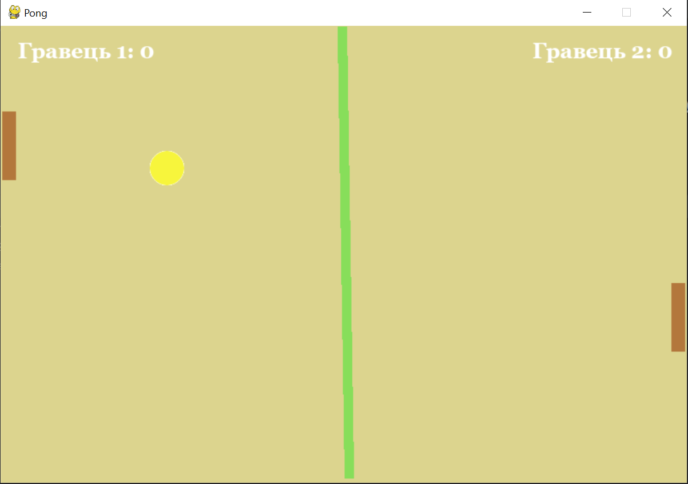

# Pong Game

### A simple pong game. My first pygame project created in order to learn how to work with this library
___

* A rule screen
* Scores
* 2 players

___

### How to Install and Run the Project
1. Clone the repository 
   > git clone https://github.com/KateFedkova/pong.git
2. Install all the requirements 
   > pip install -r requirements.txt
   
___